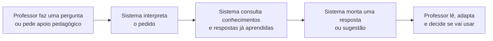
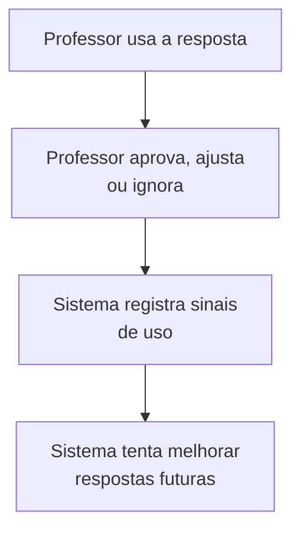
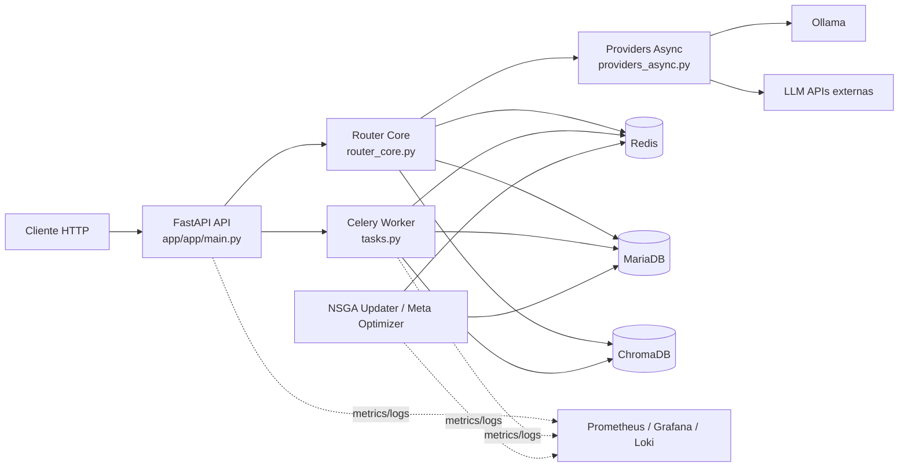

# Roteador Multiobjetivo de LLMs

Roteador de consultas para LLMs/VLMs com decisão multiobjetivo (custo, latência e qualidade), suporte multimodal, cache semântico, RAG, observabilidade e feedback contínuo.

## Para quem é este repositório
- Engenharia de backend e MLOps.
- Estagiários que vão manter endpoints, estratégias de roteamento e integrações com provedores.

## O que este sistema faz
- Recebe requisições em `POST /query`.
- Escolhe o melhor modelo com base em estratégia multiobjetivo.
- Executa fallback resiliente em caso de falha do provedor.
- Registra métricas (Prometheus), logs e feedback para aprendizagem online.

## Arquitetura em uma frase
FastAPI (`app/app/main.py`) -> roteamento (`app/app/router_core.py`) -> providers (`app/app/providers_async.py`) -> persistência/cache (MariaDB + Redis + ChromaDB) -> feedback em background (Celery/tasks).

## Entenda Rapidamente
Esta seção foi pensada para professores e outros leitores sem formação em TI.

### Como o sistema funciona para o professor
Objetivo: mostrar, em linguagem simples, o caminho da pergunta até a resposta.



Legenda:
- `Professor faz uma pergunta`: pode ser uma dúvida, explicação, atividade ou roteiro de aula.
- `Sistema interpreta o pedido`: identifica o que está sendo solicitado.
- `Consulta conhecimentos`: busca informações úteis e exemplos parecidos.
- `Monta uma resposta`: produz uma sugestão de apoio.
- `Professor lê, adapta e decide`: a decisão final continua com a pessoa docente.

### Como o sistema melhora com o uso
Objetivo: mostrar que o sistema tenta aprender com o uso, mas não substitui o julgamento do professor.



Mensagem principal:
- a IA oferece apoio;
- o professor continua responsável pela escolha pedagógica;
- o sistema tenta melhorar ao longo do tempo.

## Diagrama de contexto
Objetivo: dar uma visão rápida da stack local e das principais dependências do caminho de requisição.



Nota: o diagrama resume o fluxo principal; threads internas de manutenção do roteador e detalhes de lifecycle ficam em `docs/ARCHITECTURE.md`.

## Documentação visual
Para entender a arquitetura sem depender só de texto, use esta trilha:

1. `README.md`: visão simples para professores + diagrama de contexto técnico.
2. `docs/ARCHITECTURE.md`: visão para professores + arquitetura técnica detalhada.
3. `docs/ONBOARDING.md`: ordem recomendada de leitura dos diagramas para novos mantenedores.
4. `docs/DOCUMENTATION_WORKFLOW.md`: regra de manutenção dos diagramas na mesma PR que alterar fluxo ou dependência.

Leitura rápida:
- “Quero entender sem linguagem técnica” -> `README.md`
- “Quero entender como funciona para o professor” -> `docs/ARCHITECTURE.md`
- “Quem conversa com quem tecnicamente?” -> `README.md`
- “Onde esse comportamento mora?” -> `docs/ARCHITECTURE.md`
- “Em que ordem o fluxo acontece?” -> `docs/ARCHITECTURE.md`
- “Quando preciso atualizar os diagramas?” -> `docs/DOCUMENTATION_WORKFLOW.md`

## Primeiros 30 minutos (onboarding rápido)
1. Configure variáveis de ambiente:
- Copie `.env.example` para `.env`.
- Defina obrigatoriamente: `ADMIN_TOKEN`, `DB_PASS`, `MYSQL_ROOT_PASSWORD`, `REDIS_PASSWORD`.

2. Suba a stack local:
```bash
docker compose up -d --build
```

3. Verifique saúde da API:
```bash
curl -s http://localhost:8000/health | jq
```

4. Faça uma consulta de teste:
```bash
curl -s -X POST http://localhost:8000/query \
  -H "Content-Type: application/json" \
  -d '{"query":"Explique o que é NSGA-II em linguagem simples.","modality":"text"}' | jq
```

5. Inspecione logs da API:
```bash
docker compose logs -f api
```

6. Veja métricas:
```bash
curl -s http://localhost:8000/metrics | head -n 40
```

## Mapa de leitura para estagiário
1. `docs/ONBOARDING.md` (trilha de estudo).
2. `docs/ARCHITECTURE.md` (fluxos, componentes e diagramas Mermaid).
3. `docs/MODULE_INDEX.md` (quem faz o quê).
4. `docs/API.md` (contratos de endpoint).
5. `docs/CONFIGURATION.md` (variáveis e hot-reload).
6. `docs/FILE_CATALOG.md` (responsabilidade de cada arquivo em `app/app`).
7. `docs/METHOD_CATALOG.md` (inventário de funções/métodos com assinatura e localização).
8. `docs/DOCSTRING_BACKLOG.md` (itens pendentes de docstring detalhada).
9. `docs/DOCUMENTATION_WORKFLOW.md` (processo para manter documentação viva).
10. Código core:
- `app/app/main.py`
- `app/app/router_core.py`
- `app/app/providers_async.py`
- `app/app/settings_dynamic.py`

## Estrutura principal do projeto
- `app/app/`: API core, roteamento, providers, middlewares e utilitários.
- `tests/`: suíte de testes unitários/integrados/smoke/performance.
- `docs/`: documentação técnica.
- `docker-compose.yml`: orquestração local dos serviços.

## Fluxo de uma requisição (`/query`)
1. Middleware de correlação, backpressure e rate limit.
2. Validação da payload e normalização de modalidade.
3. Tentativa de cache semântico (`semantic_cache`).
4. Cálculo de incerteza e seleção de candidatos.
5. Escolha do modelo e chamada de provider.
6. Retorno da resposta + despacho de feedback assíncrono.

## Operação e depuração rápida
### Redis indisponível
- Sintoma: degradação para fallback em memória (rate-limit/cache parcial).
- Ação: validar container Redis, credenciais e latência de rede.

### Timeout de provider
- Sintoma: `504` em `/query`.
- Ação: revisar `MIN_TIMEOUT`, `MAX_TIMEOUT`, `ADAPTIVE_TIMEOUT_*` e estado de circuit breaker.

### Saturação de banco
- Sintoma: aumento de latência e filas internas.
- Ação: revisar pool (`app/app/db.py`) e concorrência de workers no compose.

## Comandos de desenvolvimento
```bash
# API local sem compose
cd app && uvicorn app.main:app --reload --host 0.0.0.0 --port 8000

# Testes
PYTHONPATH=app pytest -q tests

# Lint e formato
ruff check app/app tests
ruff format app/app tests

# Tipagem
mypy app/app
```

## Segurança
- Nunca comite segredos reais.
- Use `.env` local e tokens rotacionáveis.
- Endpoints administrativos aceitam `X-Admin-Token` (modo legado) ou `Authorization: Bearer <jwt>` quando `AUTH_JWT_ENABLED=1`.

## Migrações de banco (produção)
```bash
alembic -c alembic.ini upgrade head
```
Notas:
- `ROADMAP_AUTO_DDL=1` deve ser usado apenas em desenvolvimento.
- Em produção, prefira schema gerenciado por Alembic.

## Convenções de documentação no código
- Todas as funções/classes/módulos de `app/app` possuem docstring em PT-BR (Google style).
- Ao alterar comportamento, atualize docstring e documento correspondente em `docs/` na mesma PR.

## Atualização automática da documentação
Sempre que adicionar/alterar métodos ou arquivos em `app/app`, rode:
```bash
python3 scripts/generate_docs_catalog.py
```
Esse comando atualiza:
- `docs/FILE_CATALOG.md`
- `docs/METHOD_CATALOG.md`
- `docs/DOCSTRING_BACKLOG.md`

## Próximos documentos importantes
- `docs/ONBOARDING.md`
- `docs/MODULE_INDEX.md`
- `docs/ARCHITECTURE.md`
- `docs/API.md`
- `docs/CONFIGURATION.md`
- `docs/ALGORITHMS.md`
