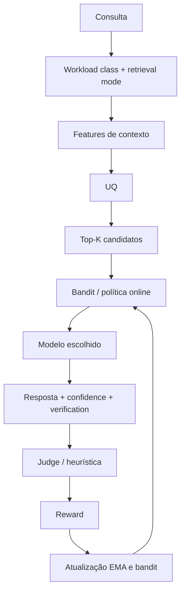

# Algoritmos e Estratégias

## Objetivo do sistema
Escolher o melhor modelo para cada requisição balanceando qualidade, latência e custo.

## Diagrama do pipeline algorítmico
Objetivo: resumir como as estratégias se encadeiam no caminho de decisão do roteador.


Nota: o diagrama mostra a ordem lógica principal; detalhes internos de cada algoritmo continuam nas seções abaixo.

## Visão para Engenharia de IA
Objetivo: destacar os mecanismos que afetam escolha de modelo, reward e aprendizagem online.



Nota: este diagrama é voltado a engenharia de IA; ele foca aprendizagem e decisão adaptativa, não topologia de serviços.

## 1. Seleção de candidatos
Arquivo principal: `app/app/router_strategy.py`

Resumo:
1. Recebe lista de modelos candidatos.
2. Aplica pesos/heurísticas por modalidade e contexto.
3. Devolve subconjunto (ex.: top-2) para decisão final.

## 2. Bandits (decisão online)
Arquivo principal: `app/app/bandits.py`

Estratégias usadas:
1. **Epsilon-greedy**: explora com probabilidade `epsilon`.
2. **UCB1**: favorece melhor média + incerteza de amostragem.
3. **Thompson Sampling**: usa distribuição para explorar/explotar.

Meta-estratégia:
- O sistema pode combinar estratégias e manter estatísticas por contexto.

## 3. Incerteza da consulta (UQ)
Arquivos: `app/app/utils/uncertainty.py`, `app/app/router_core.py`

Uso:
1. Estimar dificuldade/risco da consulta.
2. Ajustar tendência de escolha para modelos mais robustos quando necessário.

## 4. Cache semântico
Arquivo principal: `app/app/semantic_cache.py`

Camadas:
1. L1 em memória (exato, TTL curto).
2. L2 vetorial (similaridade semântica no Chroma).

Benefício:
- Redução de custo e latência para consultas recorrentes/semelhantes.

## 5. RAG (recuperação aumentada)
Arquivos: `app/app/rag_local.py`, `app/app/vectorstore.py`, `app/app/reranker.py`

Fluxo:
1. Decide entre `no_retrieval`, `light_retrieval` e `full_retrieval`.
2. Recupera contexto relevante apenas quando o gate indicar ganho esperado.
3. Reordena (reranker) quando habilitado e quando houver candidatos suficientes.
4. Enriquecer prompt antes da inferência, preservando provenance estruturada.

## 6. Fallback e circuit breaker
Arquivos: `app/app/reliability.py`, `app/app/providers_async.py`

Objetivo:
1. Evitar indisponibilidade total por falha de um único provider/modelo.
2. Encadear modelos alternativos automaticamente.
3. Cortar fallbacks tardios quando o orçamento restante do deadline síncrono já não comporta nova tentativa.

## 7. Aprendizado por feedback
Arquivos: `app/app/tasks.py`, `app/app/user_feedback.py`, `app/app/router_core.py`

Resumo:
1. Coleta feedback de qualidade.
2. Atualiza estatísticas históricas e bandit.
3. Ajusta comportamento futuro do roteador.

## 8. Juízes (rubrica de três dimensões)
Arquivos: `app/app/judges.py`, `app/app/services/judge_rubric.py`

1. Dois juízes pontuam, de 0 a 10, clareza, acurácia conceitual e alinhamento pedagógico.
2. `Q = Σ w_i·d_i / Σ w_i` (padrão 0,3 / 0,5 / 0,2); o desvio entre juízes por dimensão é registrado como concordância.
3. Se os dois divergem em mais de `JUDGE_RUBRIC_DISAGREEMENT` pontos de Q, o meta-juiz também pontua e cada dimensão fica com a mediana.
4. Juiz que falha ou devolve saída ilegível é descartado (nunca vira nota 0). Se todos falham, usa-se a heurística marcada como `heuristic_fallback`.
5. `JUDGE_SCORING_MODE=binary` mantém o veredito CORRECT/INCORRECT para benchmarks com gabarito.

## 9. Recompensa acoplada ao NSGA-II
Arquivos: `app/app/services/reward.py`, `app/app/nsga_weights_updater.py`

```
r = w_q·Q/10 + w_l·1/(1+e^{k(L−x0)}) + w_c·max(0,3; 1/(1+max(0, C/C_base − 1)))
```

- `k = 0,12`, `x0 = 20 s`, `C` em USD/1k tokens (custo de inferência, incluindo a ocupação local imputada), `C_base = REWARD_COST_BASELINE_PER_1K`.
- A cada ciclo, o NSGA-II publica `nsga:reward_weights:<modalidade>` com as parcelas `(W_Q·q̄, W_L·l̄, W_C·c̄)` normalizadas, no ponto de operação do portfólio escolhido. Os `NSGA_W_*` estão em escalas brutas; as parcelas os tornam adimensionais.
- Sem pesos publicados, usa 0,55/0,30/0,15 e incrementa `reward_weights_source_total{source="default"}`.
- Sob política congelada, o NSGA-II não publica pesos nem ajusta `UNCERTAINTY_THRESHOLD`.

## Limitações atuais
1. Heurísticas dependem da qualidade dos dados históricos.
2. Mudanças drásticas de carga podem exigir recalibração manual.
3. Configuração ruim de timeout/concorrência pode mascarar ganhos do algoritmo.
