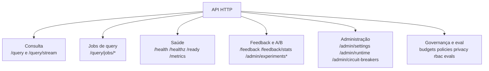
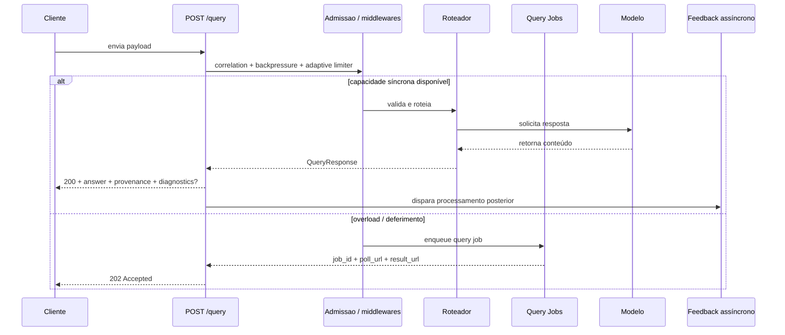
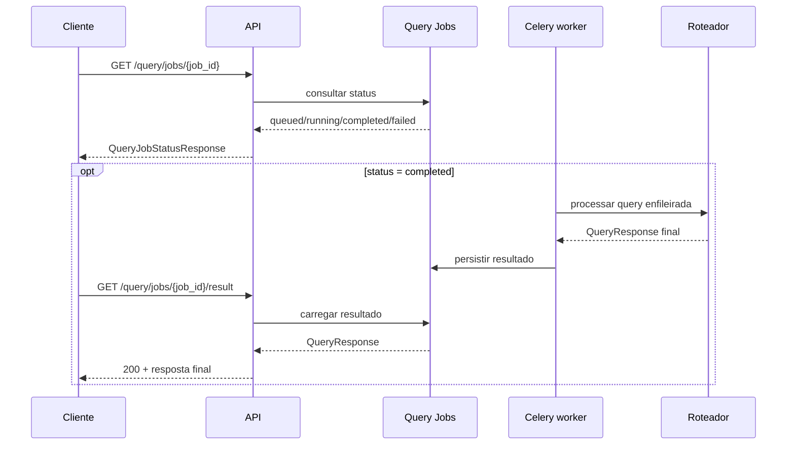

# Documentação da API

Base URL local:
```text
http://localhost:8000
```

## Mapa de endpoints
Objetivo: organizar a API por grupos funcionais antes dos detalhes de payload e autenticação.



## Sequência da chamada principal
Objetivo: mostrar a jornada mais comum de uso da API.



## Sequência do polling assíncrono
Objetivo: mostrar como o cliente busca o resultado quando `/query` responde `202`.



## Autenticação administrativa
Endpoints administrativos exigem header:
```text
X-Admin-Token: <token>
```

Quando `AUTH_JWT_ENABLED=1`, use:
```text
Authorization: Bearer <jwt>
```
Escopos aceitos (exemplos): `governance:read`, `governance:write`, `policy:read`, `policy:write`, `eval:read`, `eval:write`, `rbac:read`, `rbac:write`, `privacy:admin`, `admin:*`.

Para endpoints de governança/política/eval, também é possível autorizar por RBAC:
```text
X-User-Id: <id-do-usuario>
X-User-Roles: role_a,role_b
```

## Endpoints principais

## `POST /query`
Roteia uma consulta para o melhor modelo disponível.

### Payload mínimo
```json
{
  "query": "Explique cache semântico.",
  "modality": "text"
}
```

### Campos suportados
- `query` (string, obrigatório)
- `modality` (`text|vision|multimodal`, opcional, default `text`)
- `system_prompt` (string)
- `max_tokens` (int)
- `temperature` (float)
- `image_b64` (string)
- `images` (array de base64)
- `enable_rag_for_answer` (bool)
- `enable_rag_for_image` (bool)
- `rag_modality` (`text|vision|multimodal`)
- `use_cache` (bool)
- `timeout_seconds` (int)
- `tenant_id` (string): escopo de governança e cotas.
- `policy_version` (string): versão de política solicitada.
- `experiment_id` (string): experimento A/B para assignment de variante.
- `user_key` (string): chave estável para assignment consistente.
- `stream` (bool): usado com endpoint de streaming.
- `tools` (array): tools/function calling no formato OpenAI (ver seção Tool Calling).
- `tool_choice` (`"auto"|"none"|"required"` ou `{type:function, function:{name}}`).
- `messages` (array): histórico multi-turn (formato OpenAI) para follow-up com resultados de tools.

### Resposta (estrutura)
`POST /query` pode responder de duas formas:

1. `200 OK` com `QueryResponse`
- `answer`: texto final
- `model`: modelo usado
- `modality`: modalidade final
- `correlation_id`: id de rastreio
- `estimated_cost_usd`: custo estimado da resposta
- `confidence_score` / `confidence_band`
- `abstained` / `abstain_reason`
- `verification_status`
- `review_status`
- `provenance`: grounding, citações, snippets e `knowledge_version`
- `tool_calls` (opcional): tools solicitadas pelo modelo (formato OpenAI); presente quando `finish_reason="tool_calls"`
- `finish_reason`: `"stop" | "tool_calls" | "length" | ...`
- `diagnostics` (opcional): decisão de rota, candidatos e metadados internos

2. `202 Accepted` com `QueuedQueryAcceptedResponse`
- `job_id`
- `status`
- `poll_url`
- `result_url`
- `expires_at`
- `estimated_wait_seconds`

### Endpoints de jobs
- `GET /query/jobs/{job_id}`: retorna `QueryJobStatusResponse`
- `GET /query/jobs/{job_id}/result`: retorna `QueryResponse` quando o job terminou

### Erros comuns
- `400`: payload inválida
- `422`: há `tools` na requisição mas nenhum modelo com suporte a function calling está configurado
- `429`: rate limit ou provider rate-limit
- `502`: falha de provider
- `503`: circuit breaker aberto/backpressure
- `504`: timeout

## Tool / Function Calling
O roteador funciona como **gateway pass-through**: aceita `tools` no formato OpenAI,
repassa ao modelo escolhido (traduzindo para o formato nativo de cada provedor) e
devolve os `tool_calls`. **O cliente executa as tools** e reenvia os resultados. O
mesmo formato vale para `POST /query` e `POST /v1/chat/completions`, em qualquer
provedor (Ollama, OpenAI, Anthropic, Gemini, OpenRouter).

Formato canônico (OpenAI):
- Entrada: `tools=[{"type":"function","function":{"name","description","parameters":<JSON schema>}}]`,
  `tool_choice = "auto" | "none" | "required" | {"type":"function","function":{"name":...}}`
- Saída: `tool_calls=[{"id","type":"function","function":{"name","arguments":"<json str>"}}]` + `finish_reason="tool_calls"`

Ciclo completo (round-trip):
1. Cliente envia a pergunta + `tools`.
2. Roteador responde com `tool_calls` e `finish_reason="tool_calls"` (`answer` vazio).
3. Cliente executa as tools e reenvia o histórico em `messages` (incluindo o
   `assistant` com `tool_calls` e uma mensagem `role:"tool"` por resultado).
4. Roteador devolve a resposta final em texto.

Regras e limites:
- **Roteamento estrito**: com `tools`, só entram modelos com suporte a function
  calling. Configure-os em `CANDIDATE_TOOL_MODELS_LIST` (ou o roteador infere a
  capacidade — via registry e `supported_parameters` do OpenRouter). Sem nenhum
  candidato capaz → `422`.
- Turnos multi-turn (`messages` com histórico de tools) **ignoram cache e RAG** e
  não passam pelos juízes de qualidade (a resposta é vazia/estruturada).
- No `POST /v1/chat/completions`, `tools`/`tool_choice` e mensagens `role:"tool"`
  são mapeados automaticamente.

```bash
# 1) primeira chamada: espera finish_reason=tool_calls
curl -s -X POST http://localhost:8000/v1/chat/completions -H 'Content-Type: application/json' -d '{
  "model":"ollama/qwen2.5",
  "messages":[{"role":"user","content":"Qual o clima em Natal?"}],
  "tools":[{"type":"function","function":{"name":"get_weather","parameters":{"type":"object","properties":{"city":{"type":"string"}},"required":["city"]}}}]
}' | jq '.choices[0]'
```

## `GET /health`
Health check completo dos componentes.

## `GET /healthz`
Liveness check simples.

## `GET /ready`
Readiness check (dependências críticas).

## `GET /metrics`
Métricas Prometheus.

## Streaming

## `POST /query/stream`
Quando há capacidade síncrona, retorna SSE (`text/event-stream`) com:
- `event: meta`
- `event: token`
- `event: done`

Quando o runtime decide deferir a query, o endpoint pode responder `202 Accepted`
com o mesmo contrato de job usado em `POST /query`.

Uso:
```bash
curl -N -X POST http://localhost:8000/query/stream \
  -H "Content-Type: application/json" \
  -d '{"query":"Explique NSGA-II em tópicos.","modality":"text","stream":true}'
```

## Endpoints administrativos
- `GET /admin/settings`
- `PUT /admin/settings`
- `GET /admin/circuit-breakers`
- `POST /admin/circuit-breakers/{model_name}/reset`
- `GET /admin/cascade-status`
- `POST /admin/runtime/reset`

## Governança, política e avaliação
- `PUT /admin/budgets/{tenant_id}`
- `GET /admin/budgets/{tenant_id}`
- `PUT /admin/budgets/{tenant_id}/users/{user_key}`
- `GET /admin/budgets/{tenant_id}/users/{user_key}`
- `GET /admin/quotas/usage`
- `GET /admin/audit/events`
- `POST /admin/privacy/purge`
- `POST /admin/policies`
- `POST /admin/policies/{version}/activate`
- `GET /admin/policies`
- `POST /admin/evals/runs`
- `POST /admin/evals/runs/{run_id}/execute` (assíncrono, retorna `task_id`)
- `GET /admin/evals/runs/{run_id}`
- `GET /admin/evals/runs`
- `GET /admin/evals/runs/{run_id}/results`
- `GET /admin/evals/runs/{run_id}/progress`
- `GET /admin/evals/runs/{run_id}/significance`
- `GET /admin/evals/tasks/{task_id}`
- `POST /admin/evals/tasks/{task_id}/cancel`
- `POST /admin/rbac/grants`
- `POST /admin/rbac/revokes`
- `GET /admin/rbac/roles`

Campos extras em `POST /admin/evals/runs` para trilha acadêmica:
- `seed` (int)
- `dataset_version` (string)
- `model_snapshot` (string)
- retorno inclui `reproducibility_fingerprint`

## Feedback e A/B
- `POST /feedback`
- `GET /feedback/stats`
- Endpoints de experimento A/B em `/admin/experiments*`

## Exemplo de chamada com `curl`
```bash
curl -s -X POST http://localhost:8000/query \
  -H "Content-Type: application/json" \
  -d '{"query":"Qual a diferença entre UCB1 e Thompson Sampling?","modality":"text"}' | jq
```

## Boas práticas para clientes
1. Enviar `correlation-id` quando possível.
2. Tratar `429/503/504` com retry exponencial no cliente.
3. Evitar payloads gigantes sem necessidade.
4. Definir timeout de cliente coerente com `timeout_seconds` enviado.
