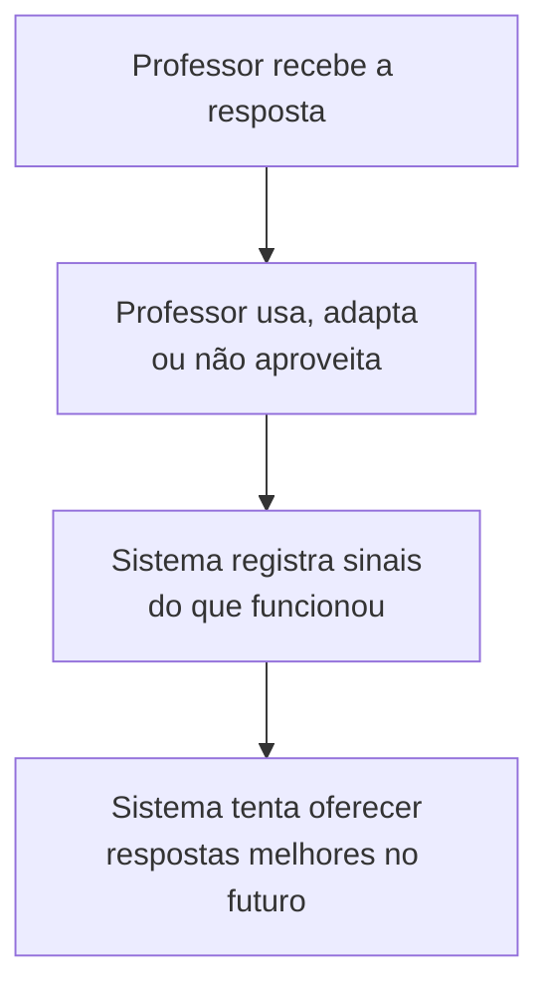
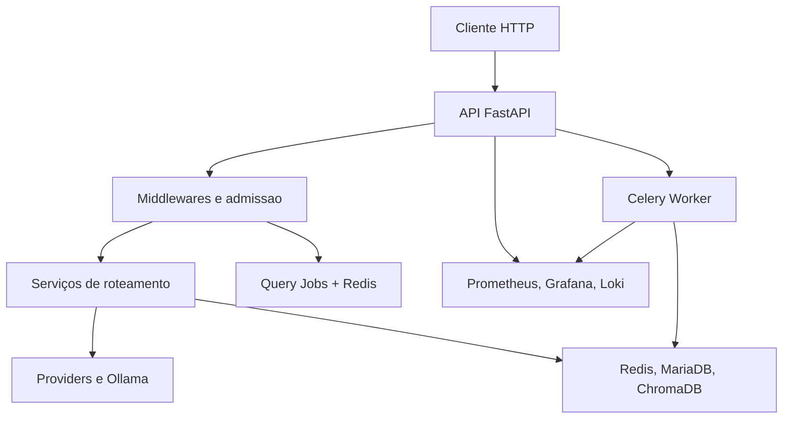
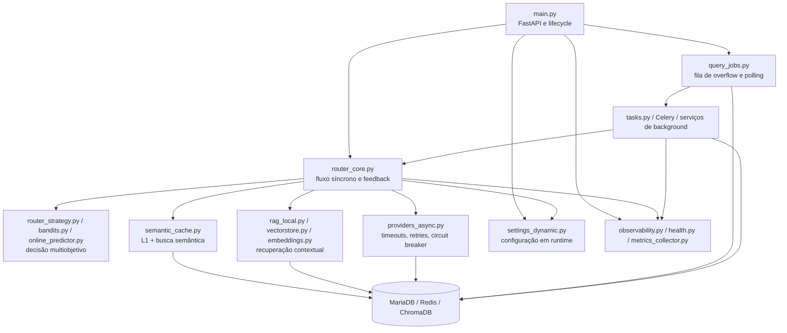
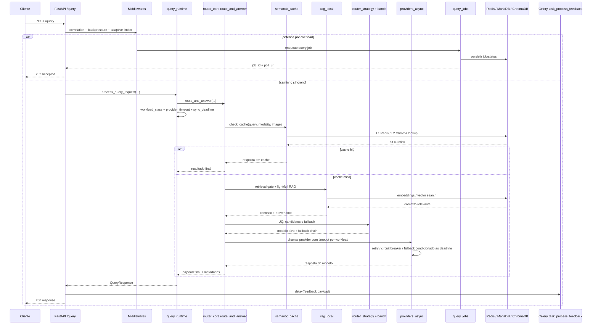
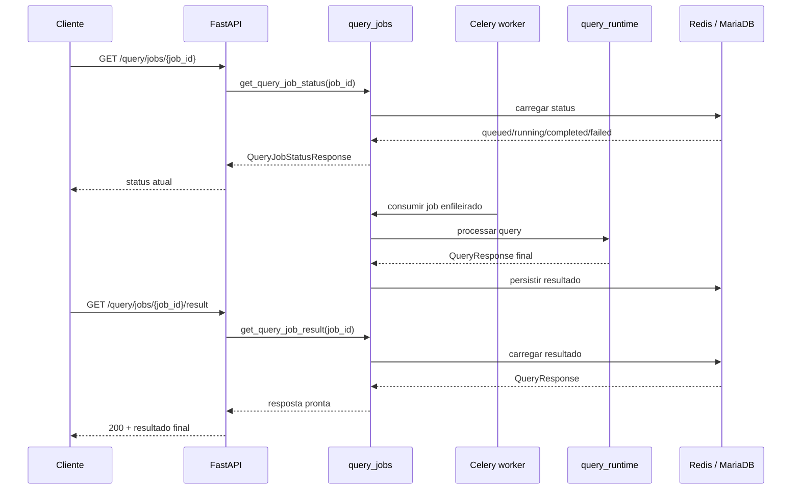
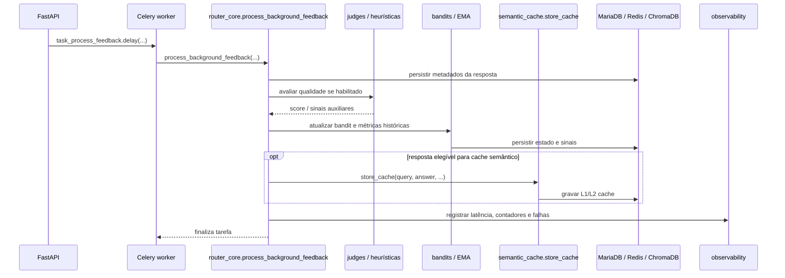

# Arquitetura do Sistema

## Visão geral
O sistema roteia consultas para modelos de linguagem com foco em equilíbrio entre:
1. Qualidade da resposta.
2. Latência.
3. Custo.

## Mapa deste documento
Objetivo: separar rapidamente a camada de explicação para professores da camada técnica detalhada.

## Visão Para Professores
Esta seção explica o sistema sem depender de nomes de arquivos, bancos ou serviços internos.

### Fluxo principal em linguagem simples
Objetivo: mostrar como uma solicitação do professor vira uma resposta de apoio.

Legenda:
- `Professor envia uma pergunta`: por exemplo, pedir explicação, atividade, resumo ou apoio de aula.
- `Sistema entende`: tenta identificar a intenção do pedido.
- `Busca informações`: consulta conteúdos e respostas anteriores relevantes.
- `Prepara uma resposta`: organiza uma sugestão útil para o contexto.
- `Professor revisa e decide`: a resposta pode ser ajustada, reaproveitada ou descartada.

### Melhoria contínua em linguagem simples
Objetivo: mostrar que o sistema tenta aprender com o uso, sem retirar o papel pedagógico do professor.

Mensagem principal:
- o sistema é um apoio ao trabalho docente;
- a decisão pedagógica continua sendo humana;
- o histórico de uso ajuda a melhorar sugestões futuras.

### Limites e uso responsável
Objetivo: deixar explícito que a resposta da IA precisa de revisão humana.

## Documentação Técnica Detalhada

## Visão para Desenvolvedores de TI
Objetivo: mostrar os blocos operacionais da stack e suas responsabilidades.

Nota: este diagrama e para backend e operacao; ele prioriza componentes implantaveis e fluxos entre servicos.

## Visão para Engenharia de IA
Objetivo: mostrar o pipeline de decisão e atualização do roteador.

Nota: este diagrama abstrai detalhes de container e infraestrutura para focar seleção, qualidade e feedback.

## Diagrama de componentes
Objetivo: mostrar como os módulos centrais se conectam no caminho de decisão e operação.

Nota: caixas agrupam módulos próximos para manter o diagrama legível; detalhes de classes e helpers ficam em `docs/MODULE_INDEX.md`.

## Componentes principais
1. **Camada HTTP (FastAPI)**
- Arquivo: `app/app/main.py`.
- Responsável por endpoints, middlewares, lifecycle e despacho de tarefas assíncronas.

2. **Core de roteamento**
- Arquivo: `app/app/router_core.py`.
- Faz cache check, estimativa de incerteza, seleção de candidatos, chamada de provider e retorno final.

3. **Estratégia de decisão**
- Arquivos: `app/app/router_strategy.py`, `app/app/bandits.py`, `app/app/online_predictor.py`.
- Combina pesos multiobjetivo + política online.

4. **Providers**
- Arquivo: `app/app/providers_async.py`.
- Integra provedores externos e locais com timeout, retry e circuit breaker.

5. **RAG e cache semântico**
- Arquivos: `app/app/rag_local.py`, `app/app/vectorstore.py`, `app/app/semantic_cache.py`, `app/app/embeddings.py`.
- Faz recuperação contextual e acelera respostas repetidas/semelhantes.

6. **Persistência e estado operacional**
- MariaDB: logs/estatísticas/configurações dinâmicas.
- Redis: estado de runtime, cache auxiliar e coordenação.
- ChromaDB: embeddings e documentos vetoriais.

7. **Observabilidade**
- Arquivos: `app/app/observability.py`, `app/app/health.py`, `app/app/metrics_collector.py`.
- Exporta métricas, saúde de componentes e rastreabilidade.

## Fluxo de requisição (`POST /query`)
1. Request entra na API e passa por correlação, backpressure e limitador adaptativo.
2. O runtime classifica a consulta (`workload_class`) e monta hints como timeout e deadline.
3. Se houver pressão operacional, a query pode ser deferida para fila assíncrona e responder `202`.
4. Se seguir no caminho síncrono, tenta cache semântico, retrieval seletivo e seleção de candidatos.
5. O provider é chamado com timeout por workload, deadline total e corte antecipado de fallback.
6. A resposta pública volta com sinais de confiabilidade, proveniência e diagnóstico opcional.
7. O feedback assíncrono continua sendo disparado em background após a resposta.

## Sequência de `POST /query`
Objetivo: mostrar o caminho síncrono principal e onde entram cache, seleção e fallback.

Nota: o diagrama destaca os dois caminhos principais atuais: resposta síncrona e deferimento assíncrono.

## Sequência de polling dos jobs de query
Objetivo: mostrar o fluxo da query deferida até o resultado final.

## Fluxo de feedback assíncrono
1. Salva metadados da resposta.
2. Avalia qualidade (heurística/juízes quando habilitado).
3. Atualiza bandit e indicadores EMA.
4. Opcionalmente armazena entrada no cache semântico.

## Sequência do feedback assíncrono
Objetivo: mostrar o que acontece após a resposta ser entregue ao cliente.

Nota: o worker pode degradar parcialmente em falhas de Redis ou judges; a intenção aqui é destacar a ordem das responsabilidades.

## Decisões arquiteturais importantes
1. **Separar caminho síncrono e assíncrono**
- Síncrono: latência da resposta ao cliente.
- Assíncrono: aprendizagem e manutenção de estado.

2. **Degradação graciosa**
- Se Redis falhar, partes do sistema degradam para estratégias locais.
- Se provider falhar, fallback chain tenta modelos alternativos.

3. **Configuração dinâmica**
- Variáveis podem ser alteradas em runtime via `settings_dynamic`.

## Limites e riscos operacionais
1. Cardinalidade de métricas muito alta pode custar caro no Prometheus.
2. Concurrency de API desbalanceada com pool de DB gera saturação.
3. Timeouts inadequados para modelos lentos causam `504` frequente.

## Onde investigar cada incidente
1. Timeouts/falhas de modelo: `providers_async.py`, `reliability.py`.
2. Seleção de modelo inesperada: `router_core.py`, `router_strategy.py`, `bandits.py`.
3. Problemas de configuração: `settings_dynamic.py`, `/admin/settings`.
4. Latência geral alta: `main.py`, `db.py`, `middleware/backpressure.py`.
