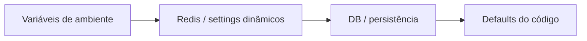

# Guia de Configuração

## Princípios
1. Configuração em camadas: env -> Redis -> DB -> defaults.
2. Parte das configurações é dinâmica (hot-reload) via `settings_dynamic`.
3. Configurações críticas devem ser explícitas em produção.

## Precedência de configuração
Objetivo: mostrar qual fonte tende a prevalecer na resolução de settings.



## Dinâmico vs restart
Objetivo: diferenciar ajustes aplicáveis em runtime daqueles que costumam exigir reinício.

```mermaid
flowchart TD
    A[Configuração alterada]
    B{Lida via settings_dynamic.get(...)?}
    C[Aplica em runtime]
    D[Provável necessidade de restart]

    A --> B
    B -->|sim| C
    B -->|não| D
```

## Variáveis críticas (obrigatórias em produção)
- `ADMIN_TOKEN` (quando `AUTH_JWT_ENABLED=0`)
- `DB_PASS`
- `MYSQL_ROOT_PASSWORD`
- `REDIS_PASSWORD`

## Variáveis recomendadas para governança (novas)
- `AB_TESTING_ENABLED`
- `REQUEST_TIMEOUT_SECONDS`
- `MAX_CONCURRENT_REQUESTS`
- `BACKPRESSURE_ENABLED`
- `AUTH_JWT_ENABLED`
- `AUTH_JWT_SECRET`
- `AUTH_JWT_ALGORITHMS`
- `AUTH_JWT_ISSUER`
- `AUTH_JWT_AUDIENCE`
- `AUTH_REQUIRE_SCOPES`
- `PRIVACY_RETENTION_DAYS`
- `PRIVACY_ANONYMIZE_IDS`
- `ROADMAP_AUTO_DDL` (somente desenvolvimento)

## Banco e cache
- `DB_HOST`, `DB_PORT`, `DB_USER`, `DB_PASS`, `DB_NAME`
- `REDIS_HOST`, `REDIS_PORT`, `REDIS_DB`, `REDIS_PASSWORD`

## Providers
- `OLLAMA_HOST`
- `OPENAI_API_KEY`
- `ANTHROPIC_API_KEY`
- `GEMINI_API_KEY`
- `OLLAMA_CONCURRENCY_LIMIT`

## Roteamento e qualidade
- `MAX_TOKENS_DEFAULT`, `TEMPERATURE_DEFAULT`
- `REQUEST_TIMEOUT_SECONDS`, `REQUEST_DEDUP_ENABLED`
- `BANDIT_EPSILON`
- `NSGA_W_QUALITY`, `NSGA_W_LATENCY`, `NSGA_W_COST`, `NSGA_W_ALIGNMENT`
- `UNCERTAINTY_THRESHOLD` (padrão `0.45`, fonte única em `config/constants.py`): acima dele a consulta é tratada como fora da região de competência. Os ajustadores online o movem em [0,20; 0,80], exceto sob política congelada.
- `REWARD_COST_BASELINE_PER_1K` (padrão `0.007` USD/1k): C_base do termo de custo da recompensa. Recalibrar com `services.reward.calibrate_cost_baseline` quando o pool de candidatos ou seus preços mudarem.
- `REWARD_WEIGHT_MIN_SHARE` (padrão `0.05`): parcela mínima de cada objetivo nos pesos da recompensa publicados pelo NSGA-II (`nsga:reward_weights:<modalidade>`).
- `JUDGE_SCORING_MODE`: `rubric` (padrão: clareza, acurácia e alinhamento pedagógico, 0–10, por dois juízes) ou `binary` (CORRECT/INCORRECT, para benchmarks com gabarito).
- `JUDGE_RUBRIC_WEIGHTS` (padrão `{"clareza":0.3,"acuracia":0.5,"alinhamento":0.2}`), `JUDGE_RUBRIC_DISAGREEMENT` (padrão `3.0`: diferença em Q a partir da qual o meta-juiz desempata pela mediana).
- `CANDIDATE_MODELS_LIST`, `CANDIDATE_VISION_MODELS_LIST`, `CANDIDATE_MULTIMODAL_MODELS_LIST`
- `CANDIDATE_TOOL_MODELS_LIST`: modelos habilitados para tool/function calling. Quando há `tools` na requisição, o roteador restringe a seleção a modelos com suporte (esta lista, ou capacidade inferida via registry/`supported_parameters` do OpenRouter). Sem nenhum candidato capaz → HTTP 422.

## Custo imputado da inferência local
Modelos locais não geram cobrança por token, mas ocupam o equipamento. O custo de inferência (EMA, NSGA-II, recompensa, `query_log.estimated_cost_usd`) soma ao custo de caixa o tempo de ocupação imputado:

```
taxa_USD/h = LOCAL_COST_USD_PER_HOUR (se > 0)
           = LOCAL_COST_HW_PRICE_USD / (LOCAL_COST_HW_LIFETIME_YEARS * 8760 * LOCAL_COST_HW_UTILIZATION)
             + (LOCAL_COST_POWER_W / 1000) * LOCAL_COST_ENERGY_USD_PER_KWH
C_local    = (t_ocupação_s / 3600) * taxa_USD/h / LOCAL_COST_PARALLEL_SLOTS
```

- `t_ocupação` vem de `total_duration` do Ollama (tempo de relógio em streams).
- `LOCAL_COST_IMPUTATION_ENABLED=0` desliga a imputação.
- O orçamento/cobrança por tenant usa somente o custo de caixa (`cash_cost_usd`).
- Os valores padrão de hardware/energia são provisórios: confirme preço, consumo sob carga e tarifa antes de experimentos.

## Resiliência
- `CIRCUIT_BREAKER_FAIL_MAX`, `CIRCUIT_BREAKER_RESET_TIMEOUT`
- `CIRCUIT_BREAKER_LOCAL_FAIL_MAX`, `CIRCUIT_BREAKER_LOCAL_RESET_TIMEOUT`
- `BACKPRESSURE_ENABLED`, `MAX_CONCURRENT_REQUESTS`
- `ADAPTIVE_TIMEOUT_ENABLED`, `MIN_TIMEOUT`, `MAX_TIMEOUT`
- `CELERY_TASK_SOFT_TIME_LIMIT`, `CELERY_TASK_TIME_LIMIT`, `CELERY_VISIBILITY_TIMEOUT`

## Cache e RAG
- `CACHE_THRESHOLD`, `CACHE_TTL_DAYS`
- `CACHE_THRESHOLD_ADAPT_ENABLED`, `CACHE_HIT_RATE_TARGET`
- `RAG_DATA_DIR`, `RERANK_ENABLED`, `RERANK_MODEL`

## Quais mudanças são dinâmicas?
Regra prática:
1. Configuração lida via `settings_dynamic.get(...)` no caminho de execução tende a ser dinâmica.
2. Configuração capturada apenas no import do módulo pode exigir restart.

## Alteração em runtime
Exemplo:
```bash
curl -X PUT http://localhost:8000/admin/settings \
  -H "X-Admin-Token: $ADMIN_TOKEN" \
  -H "Content-Type: application/json" \
  -d '{"BANDIT_EPSILON":"0.10"}'
```

## Governança e cota por tenant (MVP)
Além de settings dinâmicos globais, o sistema agora suporta:
1. Limite diário e mensal por `tenant_id`.
2. Acúmulo de uso mensal (`requests`, `tokens`, `cost_usd`).
3. Bloqueio de requisição quando limite é excedido.
4. RBAC simples por usuário (`rbac_user_roles`) para governança, política e eval.
5. Execução assíncrona de eval via Celery (`task_execute_eval_run`).
6. Relatório de significância estatística por run de avaliação.
7. Consulta de status e cancelamento de tasks de eval via endpoints administrativos.
8. Quotas por usuário (`tenant_id + user_key`) com limites diário e horário.
9. Rotina administrativa de retenção (`POST /admin/privacy/purge`).

Observação:
- A governança por tenant é aplicada quando `tenant_id` é enviado no `POST /query`.

## Perfis sugeridos
### Perfil mais barato
- Aumentar peso de custo (`NSGA_W_COST`).
- Reduzir exploração (`BANDIT_EPSILON`).

### Perfil mais rápido
- Aumentar peso de latência (`NSGA_W_LATENCY`).
- Ajustar `MAX_CONCURRENT_REQUESTS` e timeout.

### Perfil mais conservador
- Timeout mais alto para modelos complexos.
- Circuit breaker mais sensível.

## Checklist de produção
1. Segredos não versionados.
2. Health checks e métricas ativos.
3. Limites de concorrência calibrados.
4. Alertas básicos em erro/latência.
