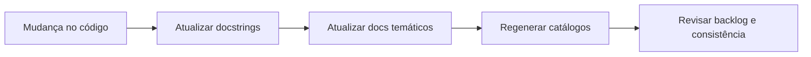

# Workflow de Documentação

Este documento define como manter a documentação técnica do projeto consistente para novos contribuidores (especialmente estagiários).

## Fluxo de atualização documental
Objetivo: resumir a sequência mínima esperada quando o código muda.



## Objetivo
1. Garantir rastreabilidade entre código e documentação.
2. Facilitar onboarding e manutenção.
3. Evitar docstrings genéricas ou desatualizadas.

## Fontes oficiais de verdade
1. Código-fonte em `app/app`.
2. Contratos HTTP em `docs/API.md`.
3. Configuração de runtime em `docs/CONFIGURATION.md`.
4. Arquitetura e módulos em `docs/ARCHITECTURE.md` e `docs/MODULE_INDEX.md`.
5. Arquivos com prefixo `00*` não devem ser tratados como fonte de verdade do runtime atual, exceto quando houver migração/compatibilidade explicitamente documentada.

## Catálogos automáticos
Gerados pelo script `scripts/generate_docs_catalog.py`:
1. `docs/FILE_CATALOG.md`
2. `docs/METHOD_CATALOG.md`
3. `docs/DOCSTRING_BACKLOG.md`

## Procedimento obrigatório em cada mudança de código
1. Atualizar docstring dos métodos e classes alterados.
2. Atualizar os documentos temáticos impactados (`API`, `CONFIGURATION`, etc.).
3. Executar:
```bash
python3 scripts/generate_docs_catalog.py
```
4. Revisar `docs/DOCSTRING_BACKLOG.md` e reduzir backlog quando possível.

## Manutenção dos diagramas
1. Mudou fluxo crítico, dependência externa ou responsabilidade entre módulos? Atualize o diagrama correspondente na mesma PR.
2. Use `Mermaid` embutido em Markdown; não adicione imagem exportada quando o diagrama puder ser versionado como texto.
3. Cada diagrama deve ter:
   - título curto;
   - objetivo em uma frase;
   - nota curta explicando simplificações relevantes.
4. Prefira:
   - `flowchart` para arquitetura, topologia e dependências;
   - `sequenceDiagram` para fluxos síncronos ou assíncronos.
5. Mantenha nomes fiéis ao código e à stack real (`router_core.py`, `providers_async.py`, `MariaDB`, `Redis`, `ChromaDB`), evitando caixas genéricas.
6. Se o fluxo ficar grande demais, divida em dois diagramas por responsabilidade em vez de aumentar ramificações.

## Critérios mínimos de qualidade de docstring
1. Explicar responsabilidade do método e contexto de uso.
2. Explicar parâmetros e retornos relevantes.
3. Evitar frases genéricas como “Resumo do comportamento desta função”.
4. Indicar efeitos colaterais importantes (I/O, DB, fila, métricas).

## Checklist de revisão para PR
1. Mudança de comportamento está refletida em docstring?
2. Endpoints alterados estão documentados em `docs/API.md`?
3. Novas variáveis de configuração estão em `docs/CONFIGURATION.md`?
4. Catálogos automáticos foram regenerados?
