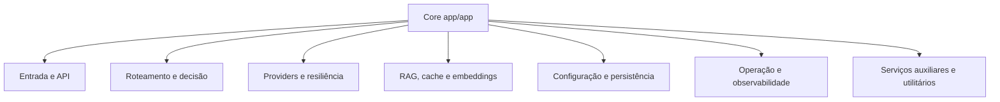

# Índice de Módulos do Core (`app/app`)

Para referência detalhada de todos os métodos e arquivos (incluindo fora de `app/app`), consulte:
1. `docs/FILE_CATALOG.md`
2. `docs/METHOD_CATALOG.md`
3. `docs/DOCSTRING_BACKLOG.md`

## Mapa do core por subsistema
Objetivo: visualizar rapidamente como os grupos de módulos se organizam no diretório `app/app`.

## Entrada e API
| Módulo | Responsabilidade | Pontos de atenção |
|---|---|---|
| `main.py` | Inicialização FastAPI, middlewares, endpoints e startup/shutdown | Segurança (`ADMIN_TOKEN`), ciclo de vida e tarefas de warmup |
| `schemas.py` | Contratos de request/response | Mudanças aqui impactam clientes da API |
| `error_handling.py` | Normalização de erros e categorias | Manter mapeamento HTTP consistente |
| `health.py` | Health checks e readiness/liveness | Não bloquear event-loop com I/O síncrono |

## Roteamento e decisão
| Módulo | Responsabilidade | Pontos de atenção |
|---|---|---|
| `router_core.py` | Pipeline principal de roteamento e resposta | Fluxo crítico de produção; atenção a fallback e timeout |
| `router_strategy.py` | Escolha de candidatos e pesos | Impacto direto em custo/qualidade |
| `bandits.py` | Aprendizagem online para seleção | Estado em Redis + robustez contra dados ruins |
| `online_predictor.py` | Predição online de erro/qualidade | Qualidade de features e drift |

## Providers e resiliência
| Módulo | Responsabilidade | Pontos de atenção |
|---|---|---|
| `providers_async.py` | Integração com Ollama/OpenAI/Anthropic/Gemini | Timeouts, retries, circuit breakers |
| `reliability.py` | Circuit breakers, deduplicação e fallback | Evitar thundering herd e falhas em cascata |
| `model_registry.py` | Catálogo central de modelos/capacidades | Atualizar preços e capacidades reais |

## RAG, cache e embeddings
| Módulo | Responsabilidade | Pontos de atenção |
|---|---|---|
| `semantic_cache.py` | Cache semântico L1/L2 | Limiar de similaridade e validade de payload |
| `vectorstore.py` | Persistência vetorial (Chroma) | Integridade de embeddings e metadados |
| `embeddings.py` | Geração de embeddings textuais/visuais | Compatibilidade de dimensão/modelo |
| `rag_local.py` | Recuperação contextual para prompt | Qualidade de chunking/reranking |
| `reranker.py` | Reordenação de resultados | Custo de inferência adicional |

## Configuração e persistência
| Módulo | Responsabilidade | Pontos de atenção |
|---|---|---|
| `settings_dynamic.py` | Config em camadas + hot-reload | Tipagem, defaults e side effects |
| `db.py` | Engine e pool SQLAlchemy | Capacidade vs concorrência da API |
| `query_service.py` | Persistência de logs e consultas | Volumetria e retenção |
| `metrics_collector.py` | Agregação de métricas por modelo | Custo de escrita e cardinalidade |

## Operação e observabilidade
| Módulo | Responsabilidade | Pontos de atenção |
|---|---|---|
| `observability.py` | Métricas Prometheus e logging | Nome de métricas e cardinalidade |
| `prometheus_setup.py` | Inicialização de métricas | Idempotência no startup |
| `middleware/*` | Backpressure, rate limiting, correlação | Ordem dos middlewares e comportamento sob falha |
| `tasks.py` / `celery_app.py` | Processamento assíncrono | Idempotência e retry de tarefas |

## Roteadores e serviços auxiliares
| Módulo | Responsabilidade | Pontos de atenção |
|---|---|---|
| `routers/rag_router.py` | Endpoints de ingestão e RAG | Validação de upload e segurança |
| `services/*` | Helpers de política/manutenção | Evitar lógica crítica duplicada |
| `utils/*` | Funções utilitárias transversais | Não concentrar regra de negócio aqui |

## Legado/experimental
Arquivos com prefixo `00*`, dashboards e módulos experimentais existem no repositório. Para manutenção de produção, priorize os módulos listados acima.
