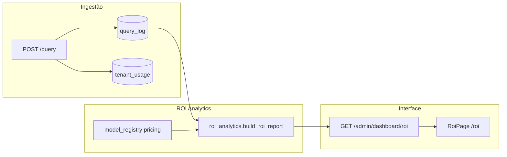

# ROI Dashboard — Economia comprovada vs baseline

Documento de design do painel de **Return on Investment (ROI)** para sustentar a promessa comercial:

> *"Reduzimos o custo por consulta útil vs seu modelo premium de referência."*

---

## Objetivo

Dar ao **admin** (hoje) e ao **cliente** (futuro customer portal) uma visão clara de:

1. Quanto foi gasto **de fato** com o router
2. Quanto **teria custado** se tudo fosse para um modelo premium fixo (baseline)
3. Economia em **$** e **%**, com série diária e breakdown por modelo
4. Custo **ajustado por qualidade** (respostas aceitáveis)

---

## Arquitetura



---

## Baseline (contrafactual)

| Parâmetro | Default | Env |
|-----------|---------|-----|
| Modelo de referência | `openai/gpt-4o` | `ROI_BASELINE_MODEL` |
| Limiar de qualidade aceitável | `6.0` | `ROI_QUALITY_THRESHOLD` |
| Estimativa de tokens | `len(texto) / 4` | — |
| Surcharge visão | `$0.004` / req | fixo no código |

**Fórmula por consulta:**

```
baseline_cost = pricing(baseline_model, tokens_in, tokens_out) + vision_surcharge
actual_cost   = estimated_cost_usd (do router)
savings       = baseline_cost - actual_cost
```

**Importante:** baseline ≠ "fatura OpenAI anterior". É um **cenário hipotético** para comparabilidade.

---

## Métricas expostas

### Summary (cards)

| Métrica | Descrição |
|---------|-----------|
| `actual_cost_usd` | Soma do custo real no período |
| `baseline_cost_usd` | Soma do contrafactual premium |
| `savings_usd` | Diferença (baseline − actual) |
| `savings_pct` | % sobre baseline |
| `cost_per_acceptable_*` | Custo por resposta com quality ≥ limiar e não abstida |
| `projected_monthly_savings_usd` | Extrapolação linear 30 dias |

### Séries e tabelas

- **daily_series**: economia por dia
- **model_breakdown**: qual modelo barato o router escolheu e quanto economizou vs baseline

### Filtros

- `tenant_id` (opcional) — requer `query_log.tenant_id`
- `days` (1–365, default 30)
- `baseline_model` (override pontual)

---

## API

```http
GET /admin/dashboard/roi?tenant_id=acme&days=30&baseline_model=openai/gpt-4o
Authorization: Bearer <admin_jwt>
```

Resposta exemplo:

```json
{
  "summary": {
    "query_count": 1240,
    "actual_cost_usd": 18.42,
    "baseline_cost_usd": 52.10,
    "savings_usd": 33.68,
    "savings_pct": 64.65,
    "projected_monthly_savings_usd": 33.68
  },
  "daily_series": [...],
  "model_breakdown": [...],
  "disclaimer": "..."
}
```

---

## UI (`/roi`)

| Seção | Conteúdo |
|-------|----------|
| Filtros | Tenant, período (7/30/90d), baseline |
| Cards | Economia $, %, custo real, baseline, projeção mensal |
| Gráfico 1 | Área: actual vs baseline por dia |
| Gráfico 2 | Barras: economia acumulada |
| Tabela | Breakdown por modelo + qualidade média |
| Rodapé | Metodologia + disclaimer legal |

---

## Evolução para customer portal (SaaS)

| Fase | Entrega |
|------|---------|
| **Hoje** | `/roi` no admin + API autenticada |
| **M2** | `GET /v1/usage/roi` scoped ao tenant do API key |
| **M3** | PDF mensal automático por e-mail |
| **M4** | Baseline = "seu modelo antes do piloto" (configurável pelo cliente) |

---

## O que pode e não pode prometer

| Afirmação | OK? |
|-----------|-----|
| "Economia de X% no custo por consulta vs GPT-4o" | Sim, com este dashboard |
| "Projeção de $Y/mês se o padrão se mantiver" | Sim, com ressalva de volume |
| "Sua fatura total da OpenAI vai cair" | Não sem qualificar volume |

---

## Arquivos

| Arquivo | Papel |
|---------|-------|
| `app/app/services/roi_analytics.py` | Cálculo ROI |
| `app/app/api/admin_dashboard_routes.py` | Endpoint |
| `admin-ui/src/pages/RoiPage.tsx` | Interface |
| `app/app/query_service.py` | `tenant_id` no log |
| `app/calculate_savings.py` | Script CLI legado (mesma lógica) |
